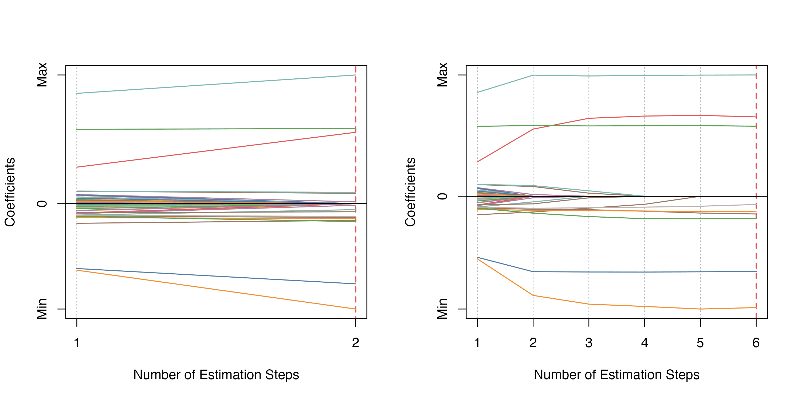
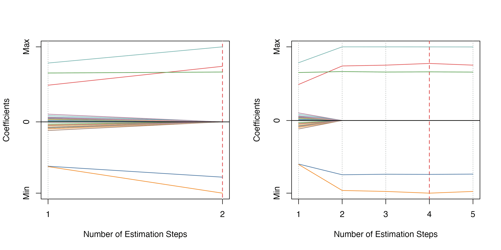
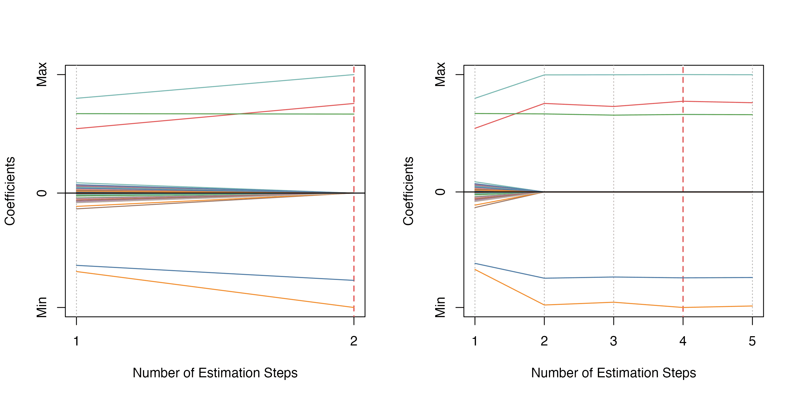

<!-- README.md is generated from README.Rmd. Please edit that file -->

# msaenet 

<!-- badges: start -->

[](https://github.com/nanxstats/msaenet/actions/workflows/R-CMD-check.yaml)
[](https://cran.r-project.org/package=msaenet)
[](https://cran.r-project.org/package=msaenet)
<!-- badges: end -->

msaenet implements the multi-step adaptive elastic-net (MSAENet)
algorithm for feature selection in high-dimensional regressions proposed
in Xiao and Xu (2015) \[[PDF](https://nanx.me/papers/msaenet.pdf)\].

Nonconvex multi-step adaptive estimations based on MCP-net or SCAD-net
are also supported.

Check `vignette("msaenet")` to get started.

## Installation

You can install msaenet from CRAN:

``` r
install.packages("msaenet")
```

Or try the development version on GitHub:

``` r
remotes::install_github("nanxstats/msaenet")
```

## Citation

To cite the msaenet package in publications, please use

> Nan Xiao and Qing-Song Xu. (2015). Multi-step adaptive elastic-net:
> reducing false positives in high-dimensional variable selection.
> *Journal of Statistical Computation and Simulation* 85(18), 3755–3765.

A BibTeX entry for LaTeX users is

``` bibtex
@article{,
  title   = {Multi-step adaptive elastic-net: reducing false positives in high-dimensional variable selection},
  author  = {Nan Xiao and Qing-Song Xu},
  journal = {Journal of Statistical Computation and Simulation},
  volume  = {85},
  number  = {18},
  pages   = {3755--3765},
  year    = {2015},
  doi     = {10.1080/00949655.2015.1016944}
}
```

## Gallery

### Adaptive Elastic-Net / Multi-Step Adaptive Elastic-Net



### Adaptive MCP-Net / Multi-Step Adaptive MCP-Net



### Adaptive SCAD-Net / Multi-Step Adaptive SCAD-Net



## Contribute

To contribute to this project, please take a look at the [Contributing
Guidelines](https://nanx.me/msaenet/CONTRIBUTING.html) first. Please
note that the msaenet project is released with a [Contributor Code of
Conduct](https://nanx.me/msaenet/CODE_OF_CONDUCT.html). By contributing
to this project, you agree to abide by its terms.

## License

msaenet is free and open source software, licensed under GPL-3.
